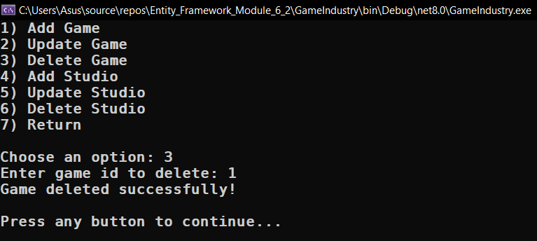

# Module 6.2

## Game Industry

- [Program.cs](GameIndustry/Program.cs)
- [Entities/](GameIndustry/Entities/)
  - [Game.cs](GameIndustry/Entities/Game.cs)
  - [Studio.cs](GameIndustry/Entities/Studio.cs)
  - [City.cs](GameIndustry/Entities/City.cs)
  - [Country.cs](GameIndustry/Entities/Country.cs)
- [GameContext.cs](GameIndustry/GameContext.cs)
- [GameRepository.cs](GameIndustry/GameRepository.cs)
- [Migrations/](GameIndustry/Migrations)
  - [InitialCreate.cs](GameIndustry/Migrations/20240328093936_InitialCreate.cs)

## Images

### Menu

### Search info

|                     |                     |
| :-----------------: | :-----------------: |
|  |  |
|  |  |
|  |  |
|  |  |

### Show info

|                     |                     |
| :-----------------: | :-----------------: |
|  |  |
|  |  |
|  |  |

### Show additional info

|                     |                     |
| :-----------------: | :-----------------: |
|  |  |
|  |  |
|  |  |
|  |                     |

### Add/Update/Delete

|                     |                     |
| :-----------------: | :-----------------: |
|  |  |
|  |  |
|  |  |
